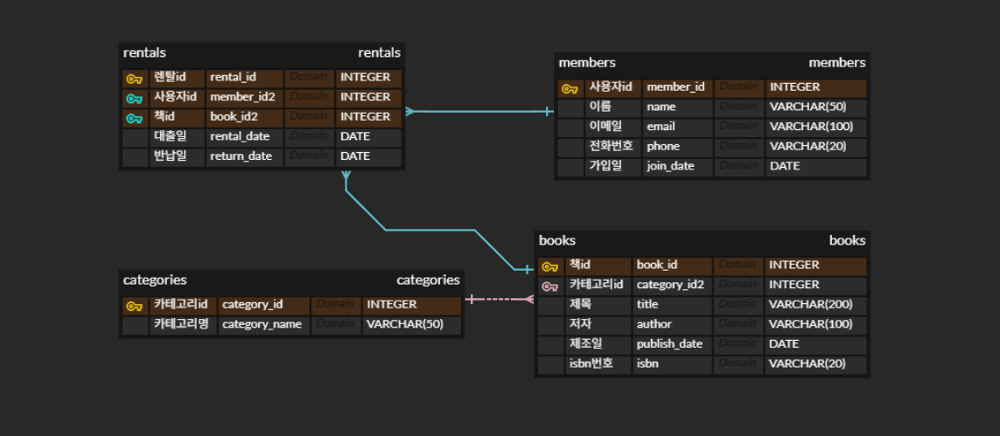
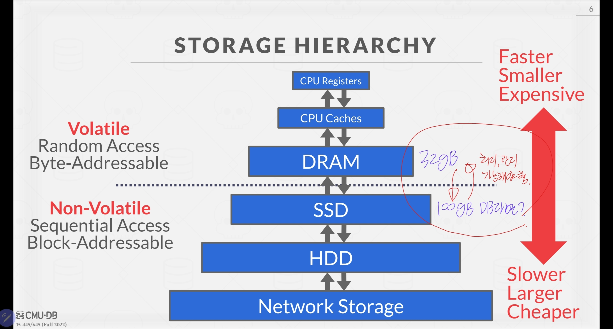
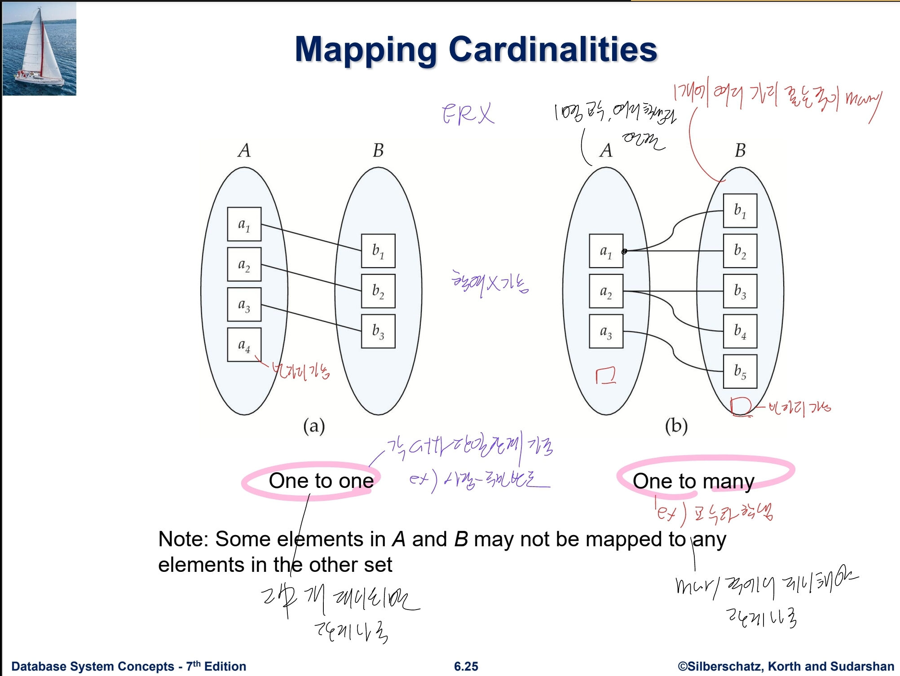
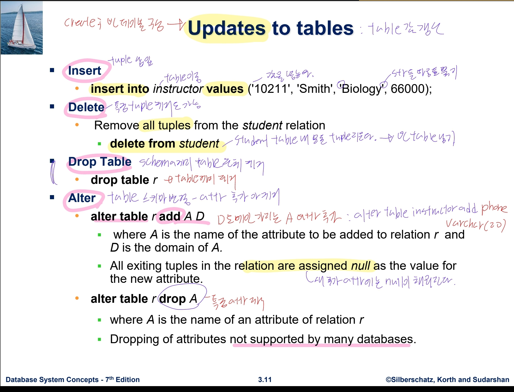
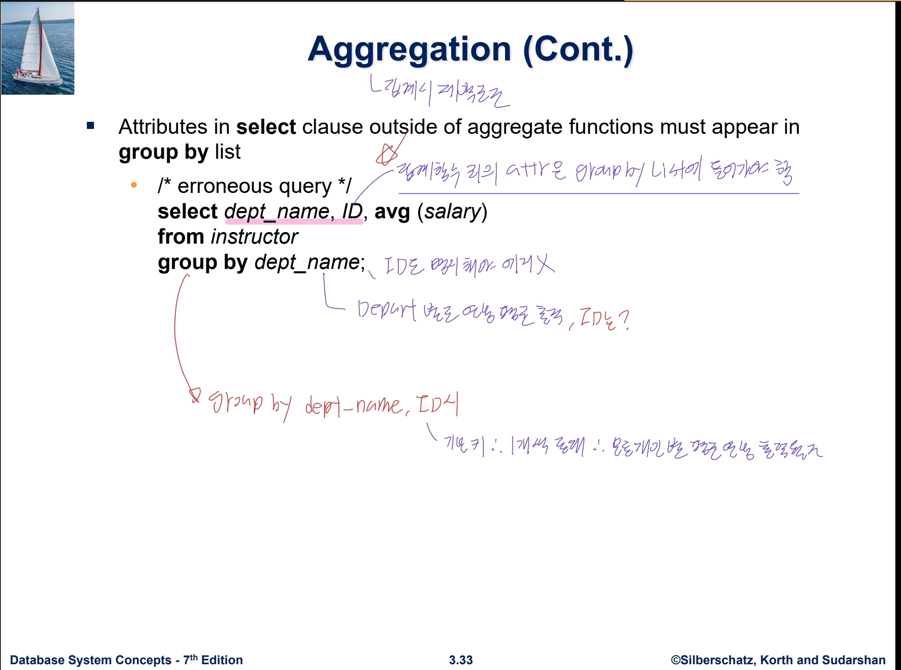
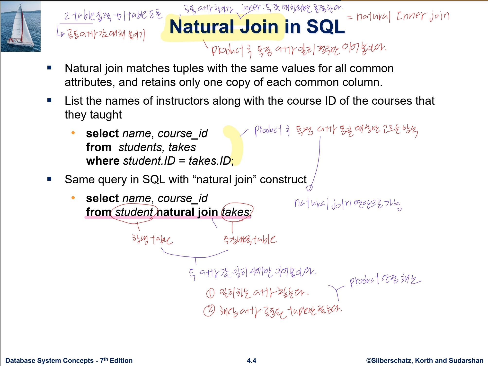

## 전체 er-diagram 구조


### DB 실행 방식
- `sqlite3` 명령 통해 sqlite 실행
- `.open test.db` 명령 통해 test.db 파일 생성
- `.read 파일이름.sql` 통해 특정 sql 구문 실행 가능
----

### 1. 스키마 생성 스크립트 (create_table.sql)

#### 총 4개의 테이블(members, categories, books, rentals)을 설계했습니다.

- 1:N 관계 1: categories (1) -> books (many)
- 1:N 관계 2: members (1) -> rentals (many)
- 1:N 관계 3: books (1) -> rentals (many)

- 각 table의 기본키는 따로 입력되지 않더라도 자동으로 입력 및 추가되도록 AUTOINCREMENT 태그 추가
- 외례키 조건 reference 추가하여 해당 attribute에는 대상 table에 있는 내용만 추가되도록 설정
- not null 태그 부여된 열에는 null 값 사용시 에러 발생
- default 태그 값은 insert시 해당 값이 명시되지 않으면 사용될 것

```
-- 1. 회원(members) 테이블
CREATE TABLE members (
    member_id INTEGER PRIMARY KEY AUTOINCREMENT,
    name VARCHAR(50) NOT NULL,
    email VARCHAR(100) UNIQUE NOT NULL,
    phone VARCHAR(20),
    join_date DATE DEFAULT (date('now'))
);  

-- 2. 카테고리(categories) 테이블
CREATE TABLE categories (
    category_id INTEGER PRIMARY KEY AUTOINCREMENT,
    category_name VARCHAR(50) NOT NULL UNIQUE
);

-- 3. 도서(books) 테이블
CREATE TABLE books (
    book_id INTEGER PRIMARY KEY AUTOINCREMENT,
    title VARCHAR(200) NOT NULL,
    author VARCHAR(100) NOT NULL,
    category_id INTEGER NOT NULL,
    publish_date DATE,
    isbn VARCHAR(20) UNIQUE NOT NULL,
    FOREIGN KEY (category_id) REFERENCES categories
);

-- 4. 대출 기록(rentals) 테이블
CREATE TABLE rentals (
    rental_id INTEGER PRIMARY KEY AUTOINCREMENT,
    member_id INTEGER NOT NULL,
    book_id INTEGER NOT NULL,
    rental_date DATE DEFAULT (date('now')),
    return_date DATE, -- 반납되지 않은 경우 NULL
    FOREIGN KEY (member_id) REFERENCES members,
    FOREIGN KEY (book_id) REFERENCES books
);

```


### 2. 샘플 데이터 입력 스크립트 (insert_table.sql)
#### insert into (table) values (내용) 구문을 통해 table에 각 행의 데이터 추가
- 각 table의 기본키는 명시하지 않아도 자동으로 추가될 것 (autoIncrease)

```
-- 회원 데이터 10건
INSERT INTO members (name, email, phone, join_date) VALUES 
('김철수', 'chulsoo@example.com', '010-1111-2222', '2025-10-01'),
('이영희', 'younghee@example.com', '010-3333-4444', '2025-10-05'),
('박민수', 'minsoo@example.com', '010-5555-6666', '2025-10-10'),
('정수진', 'soojin@example.com', '010-7777-8888', '2025-11-02'),
('최동훈', 'donghoon@example.com', '010-9999-0000', '2025-11-15'),
('강지영', 'jiyoung@example.com', '010-1234-5678', '2025-12-01'),
('윤호준', 'hojun@example.com', '010-8765-4321', '2026-01-10'),
('임유리', 'yuri@example.com', '010-1357-2468', '2026-02-20'),
('한성민', 'sungmin@example.com', '010-2468-1357', '2026-03-05'),
('송지아', 'jia@example.com', '010-1122-3344', '2026-04-12');

-- 카테고리 데이터 10건
INSERT INTO categories (category_name) VALUES 
('소설'), ('에세이'), ('역사'), ('과학'), ('IT/프로그래밍'), 
('경제/경영'), ('자기계발'), ('인문학'), ('예술'), ('만화');

-- 도서 데이터 10건
INSERT INTO books (title, author, category_id, publish_date, isbn) VALUES 
('해리포터와 마법사의 돌', 'J.K. 롤링', 1, '1997-06-26', '9788983920677'),
('클린 코드', '로버트 C. 마틴', 5, '2013-12-24', '9788966260959'),
('사피엔스', '유발 하라리', 3, '2015-11-23', '9788934972464'),
('코스모스', '칼 세이건', 4, '2006-12-20', '9788983711892'),
('부의 추월차선', '엠제이 드마코', 6, '2013-08-20', '9788997396144'),
('아주 작은 습관의 힘', '제임스 클리어', 7, '2019-02-26', '9791162540640'),
('이기적 유전자', '리처드 도킨스', 4, '2018-10-20', '9788932473901'),
('객체지향의 사실과 오해', '조영호', 5, '2015-06-17', '9788998139766'),
('침묵의 봄', '레이첼 카슨', 4, '2011-12-30', '9788962620450'),
('군주론', '니콜로 마키아벨리', 8, '2015-05-15', '9788932473338');

-- 대출 데이터 10건 (반납 완료 7건, 미반납 3건)
INSERT INTO rentals (member_id, book_id, rental_date, return_date) VALUES 
(1, 2, '2026-04-01', '2026-04-08'),
(2, 3, '2026-04-05', '2026-04-12'),
(1, 8, '2026-04-10', '2026-04-17'),
(3, 1, '2026-04-12', NULL),  -- 미반납
(4, 5, '2026-04-15', '2026-04-20'),
(5, 4, '2026-04-18', '2026-04-25'),
(6, 6, '2026-04-20', NULL),  -- 미반납
(1, 7, '2026-04-22', '2026-04-29'),
(2, 9, '2026-05-01', NULL),  -- 미반납
(7, 10, '2026-05-02', '2026-05-06');

```


### 3. SQL 쿼리문 동작 확인 (insert_sql_query.sql)
#### insert into (table) values (내용) 구문을 통해 table에 각 행의 데이터 추가


#### 3-1 전체 회원을 가입일 기준 최신순으로 3명 조회 (WHERE, ORDER BY, LIMIT)
- 가장 최근에 가입한 회원이 누구인지 확인하기
    - SELECT문을 통해 확인할 attribute(열) 파악
    - FROM 절을 통해 확인할 table 파악
    - ORDER BY 통해 특정 열에 대해 정렬 방식 파악
```
SELECT name, email, join_date 
FROM members 
ORDER BY join_date DESC 
LIMIT 3;
```

- 결과
```
송지아 | jia@example.com | 2026-04-12
한성민 | sungmin@example.com | 2026-03-05
임유리 | yuri@example.com | 2026-02-20
```


#### 3-2 특정 도서 검색 (WHERE)

- 'IT/프로그래밍' 관련 도서(카테고리 ID 5)를 찾기

```
SELECT title, author 
FROM books 
WHERE category_id = 5;
```
- 결과
```
클린 코드 | 로버트 C. 마틴
객체지향의 사실과 오해 | 조영호
```

#### 3-3 현재 대출 중인(미반납) 목록 조회 (IS NULL)
- 반납일이 기록되지 않은 대출 건 확인
    - `is NULL` 태그 통해 NULL 값 가진 행 파악 가능

```
SELECT rental_id, member_id, book_id, rental_date 
FROM rentals 
WHERE return_date IS NULL;
```
- 결과
```
4 | 3 | 1 | 2026-04-12
7 | 6 | 6 | 2026-04-20
9 | 2 | 9 | 2026-05-01
```

#### 3-4 2026년 4월 15일 이후에 대출된 기록 조회 (WHERE DATE)

- 특정 기간 이후에 발생한 대출 이력 추적
    - where 조건문으로 4월 15일 이후 기록 조회 가능

```
SELECT rental_id, book_id, rental_date 
FROM rentals 
WHERE rental_date >= '2026-04-15';
```

- 결과

```
5|5|2026-04-15
6|4|2026-04-18
7|6|2026-04-20
8|7|2026-04-22
9|9|2026-05-01
10|10|2026-05-02
```


#### 3-5 도서명과 해당 도서의 카테고리명 함께 조회 (INNER JOIN)

- FK로 연결된 categories 테이블을 조인하여 숫자가 아닌 이름으로 카테고리를 확인
    - inner join 사용시 on 절을 활용하여 연결할 열을 직접 지정해야 함.

```
SELECT b.title, c.category_name 
FROM books b
INNER JOIN categories c ON b.category_id = c.category_id;

```

- inner join 대신 natural join 사용시 자동으로 연결할 열을 지정함
```
SELECT title, category_name 
FROM books NATURAL JOIN categories
```

- 결과
```
해리포터와 마법사의 돌|소설
클린 코드|IT/프로그래밍
사피엔스|역사
코스모스|과학
부의 추월차선|경제/경영
아주 작은 습관의 힘|자기계발
이기적 유전자|과학
객체지향의 사실과 오해|IT/프로그래밍
침묵의 봄|과학
군주론|인문학
```
#### 3-6 특정 회원이 대출한 도서 목록 조회 (INNER JOIN)

- '김철수' 회원이 어떤 책을 대출했는지 이력을 확인

```
SELECT m.name, b.title, r.rental_date
FROM rentals r
INNER JOIN members m ON r.member_id = m.member_id
INNER JOIN books b ON r.book_id = b.book_id
WHERE m.name = '김철수';
```
- natural join 활용 사례
SELECT name, title, rental_date
FROM members NATURAL JOIN rentals NATURAL JOIN books
WHERE name = '김철수';

- 결과
```
김철수|클린 코드|2026-04-01
김철수|객체지향의 사실과 오해|2026-04-10
김철수|이기적 유전자|2026-04-22
```


#### 3-7 등록된 모든 카테고리와 해당 카테고리의 책 개수 확인 (LEFT JOIN)

- 도서가 하나도 등록되지 않은 카테고리도 포함하여 목록을 보여줍니다.
    - left join시 두 table에 동시에 있는 값이 아니더라도 좌측 table에 있는 값도 함께 출력됨
    - 단 이 경우 우측 table에 대한 값이 null로 기제될 가능성 존재.

```
SELECT c.category_name, COUNT(b.book_id) as book_count
FROM categories c LEFT JOIN books b ON c.category_id = b.category_id
GROUP BY c.category_name;
```

- 결과
```
IT/프로그래밍|2
경제/경영|1
과학|3
만화|0
소설|1
에세이|0
역사|1
예술|0
인문학|1
자기계발|1
```


#### 3-8 미반납된 책의 제목과 빌려간 사람의 이름, 연락처 조회 (INNER JOIN 다중)

-  연체자에게 연락하기 위해 필요한 정보를 3개 테이블 조인으로 가져오기

```
SELECT m.name, m.phone, b.title, r.rental_date
FROM rentals r
INNER JOIN members m ON r.member_id = m.member_id
INNER JOIN books b ON r.book_id = b.book_id
WHERE r.return_date IS NULL;
```
- 결과
```
박민수 | 010-5555-6666 | 해리포터와 마법사의 돌 | 2026-04-12
강지영 | 010-1234-5678 | 아주 작은 습관의 힘 | 2026-04-20
이영희 | 010-3333-4444 | 침묵의 봄 | 2026-05-01
```

#### 3-9 카테고리별 도서 개수 집계 (COUNT + GROUP BY)

- 어떤 분류의 책을 가장 많이 보유하고 있는지 확인합니다.
    - 집계함수 (count, sum 등)에 포함되지 않는 열은 GROUP BY 항목에 반드시 지정해야 함.
    - 미지정시 에러 발생

```
SELECT category_id, COUNT(*) as total_books
FROM books
GROUP BY category_id;
```

- 결과
```
1|1
3|1
4|3
5|2
6|1
7|1
8|1
```

#### 3-10 회원별 총 대출 횟수 집계 (COUNT + GROUP BY)

- 누가 가장 책을 많이 빌려보는지 우수 회원을 식별
```
SELECT member_id, COUNT(rental_id) as rental_count
FROM rentals
GROUP BY member_id
ORDER BY rental_count DESC;
```

- 결과
 ```
1 | 3 (김철수)
2 | 2 (이영희)
3 | 1 ...
 ```

#### 3-11 평균 대출 기간(일수) 계산 (AVG)
- 반납이 완료된 대출 건들에 대해 사람들이 보통 며칠 만에 책을 반납하는지 계산
    - date 형식의 값을 연산 가능한 julianday 값으로 변환 후 연산 진행
    - 평균을 구한 뒤 반올림한 값을 사용한다.
    - null 이 아닌 값을 대상으로 진행할 것.
```
SELECT ROUND(AVG(julianday(return_date) - julianday(rental_date)), 1) as avg_rental_days
FROM rentals
WHERE return_date IS NOT NULL;
```
- 결과
```
6.3
```


#### 3-12 '칼 세이건'의 책을 대출한 적이 있는 회원의 이름 조회

- 특정 저자의 독자을 서브쿼리를 통해 찾기
```
SELECT name 
FROM members 
WHERE member_id IN (
    SELECT member_id 
    FROM rentals 
    WHERE book_id IN (
        SELECT book_id 
        FROM books 
        WHERE author = '칼 세이건'
    )
);
```

- 결과
```
최동훈
```


#### 3-13 도서 반납 처리 (UPDATE)

- rental_id가 4인 대출 건(박민수의 해리포터)을 오늘 날짜로 반납 처리.

```
UPDATE rentals 
SET return_date = date('now') 
WHERE rental_id = 4;
```

- 결과
```
rental_id 4의 return_date가 NULL에서 오늘 날짜로 변경
```

#### 3-14 기록이 없는 가짜/오류 카테고리 삭제 (DELETE)

- '만화' 카테고리(category_id=10)처럼 연결된 도서가 없는 데이터를 제거
```
DELETE FROM categories 
WHERE category_id NOT IN (SELECT DISTINCT category_id FROM books);
```

```
도서가 등록되지 않은 카테고리(에세이, 예술, 만화 등) 3개 row deleted.
```
#### 3-15 도서 검색 성능 향상을 위한 인덱스 생성 (CREATE INDEX)
- index (색인이란?)
    - 조회 빈도가 높을 것이라고 판단되는 column에 대해 indexing
    - 별도 공간에 특정 column 데이터 정렬, 저장. 이를 통해 빠른 식별 가능

```
CREATE INDEX idx_books_title ON books(title);
```

- 결과
```
인덱스 생성 완료. SELECT * FROM books WHERE title = '클린 코드'; 실행 시 이 인덱스를 사용합니다.
```

-----


### 4. DB와 엑셀은 무엇이 다른가?

- disk에서 메모리로 데이터를 꺼내올 경우
- 메모리보다 큰 disk 내용을 관리해야 할 수 있음
- 이때 엑셀과 달리 DB는 DBMS 관리 시스템을 통해 자원을 효율적으로 관리한다.
- 또한 table 단위로 값을 관리하기에 불필요한 값을 저장하지 않고 수요에 따라 맞춤 제작이 가능하다.
### 5. PK/FK가 무엇인가? 1:N 관계가 데이터를 어떻게 연결하는가

- primary key
    - 각 table 단위로 존재
    - table의 row 값을 하나씩 식별하기 위한 attribute

- foreign key
    - 특정 column의 값을 제한하기 위한 역할
    - ex. 해당 columns의 값을 타 table의 특정 columns에 있는 값으로만 제한한다.
### 6. SELECT / INSERT/ UPDATE / DELETE 는 언제 쓰는가.


### 7. JOIN과 GROUP BY의 사용 방식




------
## 8-1 보너스 과제 1. 조인 1개를 두 방식으로 풀기
- natural join 통해 클린코드 책 대출한 사람의 email 판단

```
SELECT email 
FROM members
NATURAL JOIN rentals
NATURAL JOIN books
WHERE title = '클린 코드';
```
- 서브 쿼리 통한 join문 대체 가능

```
SELECT email 
FROM members 
WHERE member_id IN (
    SELECT member_id 
    FROM rentals 
    WHERE book_id = (SELECT book_id FROM books WHERE title = '클린 코드')
);
```
## 8-2 데이터 정합성 깨뜨려 보기 (FK 제약조건 에러)
-  회원가입을 하지 않은 존재하지 않는 member_id=999를 대출 기록에 INSERT 시도.
```
INSERT INTO rentals (member_id, book_id, rental_date) 
VALUES (999, 1, '2026-05-06');
```

- 결과 : foreign key 조건 불만족에 따라 insert되지 않는다.
 ```
 Runtime error: FOREIGN KEY constraint failed - 
 ```


 ## 8-3 미니 리포트

 ### 1. 가장 인기있는 도서 top3 파악
```
SELECT title, COUNT(rental_id) AS total_rentals
FROM books
NATURAL LEFT JOIN rentals
GROUP BY book_id, title
ORDER BY total_rentals DESC
LIMIT 3;
```


### 2. 가장 인기 없는 도서 top3 파악
```
SELECT category_name, COUNT(rental_id) AS total_rentals
FROM categories
NATURAL LEFT JOIN books
NATURAL LEFT JOIN rentals
GROUP BY category_id, category_name
ORDER BY total_rentals ASC
LIMIT 3;
```


### 3. 가장 대출을 많이 한 사람 top3 파악
```
SELECT name, COUNT(rental_id) AS rental_count
FROM members
NATURAL LEFT JOIN rentals
GROUP BY member_id, name
ORDER BY rental_count DESC
LIMIT 3;
```